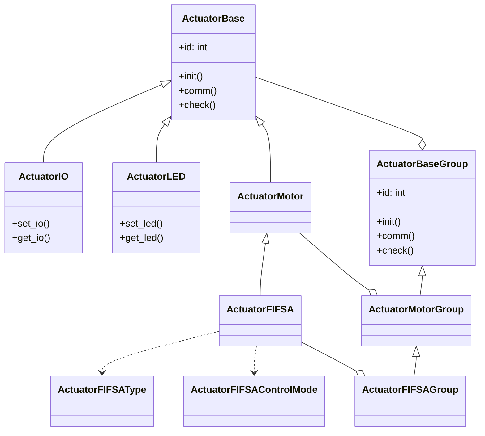
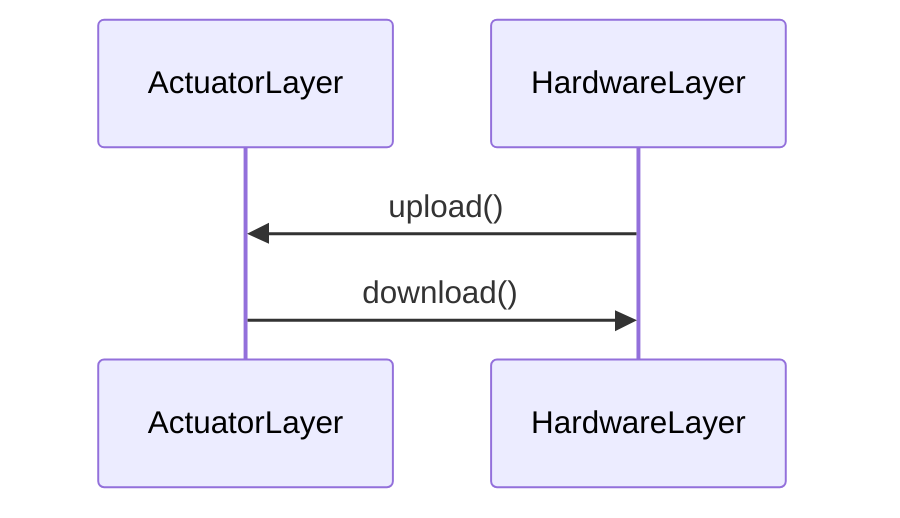

# 执行器 （组件层）

执行器属于架构设计中的组件层，其下层连接着硬件层，上层连接着机器人层。

执行器层的主要功能是将各个不同品牌的电机执行器，使用相同的抽象类型 `ActuatorBase` 进行封装，以便于机器人层调用，而不需要关心具体的执行器品牌和接口调用顺序。

> **说明**：
> 部分厂家的执行器的接口差异较大，可能会存在一些特殊的接口调用，这种情况下，需要在执行器层进行适配，以保证机器人层的统一调用。
> 如果出现无法较好适配的执行器，可以考虑在 `ActuatorBase` 的基础上进行接口扩展，以适配特殊的执行器。

同时，在此层中，除了常规的电机执行器外，还可以包含其他的执行器，如 IO控制执行器，LED控制执行器，以及其他类型的执行器，我们统称为执行器。

## 类型关系

执行器层的类型关系如下：

> **说明**：
> 这里的图形需要使用支持 `mermaid` 的 Markdown 编辑器才能正常显示。

## 接口说明

关节层的接口说明如下：

- `upload()`：上传执行器的状态参数，该方法会从硬件层读取电机的**状态参数**，并将其上传到执行器层。数据传输会经过**执行器层**，**硬件层**。
- `download()`：下载执行器的控制参数，该方法会将执行器的**控制参数**下载到硬件层，以便硬件层控制电机。数据传输会经过**执行器层**，**硬件层**。

