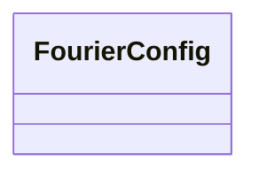

# 配置 （全局）

配置属于架构设计中的全局变量。

## 类型关系

配置层的类型关系如下：

```mermaid
classDiagram
    class FourierConfig {
    }
```

> **说明**：
> 这里的图形需要使用支持 `mermaid` 的 Markdown 编辑器才能正常显示。

配置层的 `FourierConfig` 仅调用一次，生成 `gl_config` 全局变量，用于管理整个程序的配置。