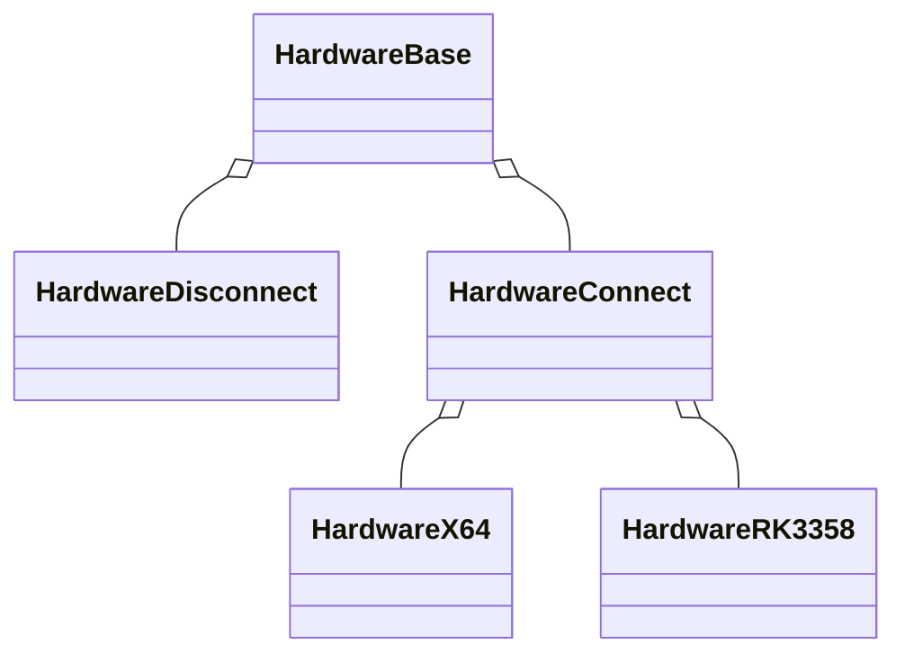

# 硬件

硬件层是项目的HAL（硬件抽象层）。
它负责软件与硬件之间的通信。
它是项目的最低层，也是唯一可以与硬件通信的层。
硬件层负责以下任务：

- 初始化硬件
- 读取传感器
- 写入执行器
- 与其他设备通信
- 处理中断
- 管理电源
- 等等

## 类关系

```mermaid
classDiagram
    class HardwareBase {
    }
    class HardwareDisconnect {
    }
    class HardwareConnect {
    }
    class HardwareX64 {
    }
    class HardwareRK3358 {
    }

    HardwareBase o-- HardwareDisconnect
    HardwareBase o-- HardwareConnect
    HardwareConnect o-- HardwareX64
    HardwareConnect o-- HardwareRK3358
```

> **说明**：
> 这里的图形需要使用支持 `mermaid` 的 Markdown 编辑器才能正常显示。
