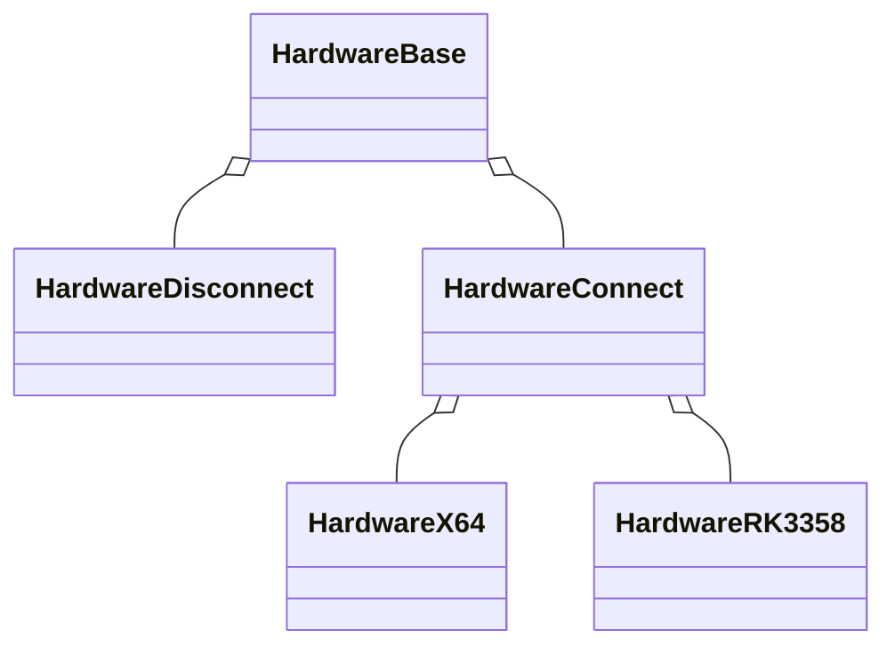

# Hardware

Hardware layer is the HAL(Hardware Abstraction Layer) of the project.
It is responsible for the communication between the software and the hardware.
It is the lowest layer of the project and it is the only layer that can communicate with the hardware.
The hardware layer is responsible for the following tasks:

- Initializing the hardware
- Reading the sensors
- Writing to the actuators
- Communicating with the other devices
- Handling the interrupts
- Managing the power
- etc.

## Class relationships

> **说明**：
> 这里的图形需要使用支持 `mermaid` 的 Markdown 编辑器才能正常显示。
