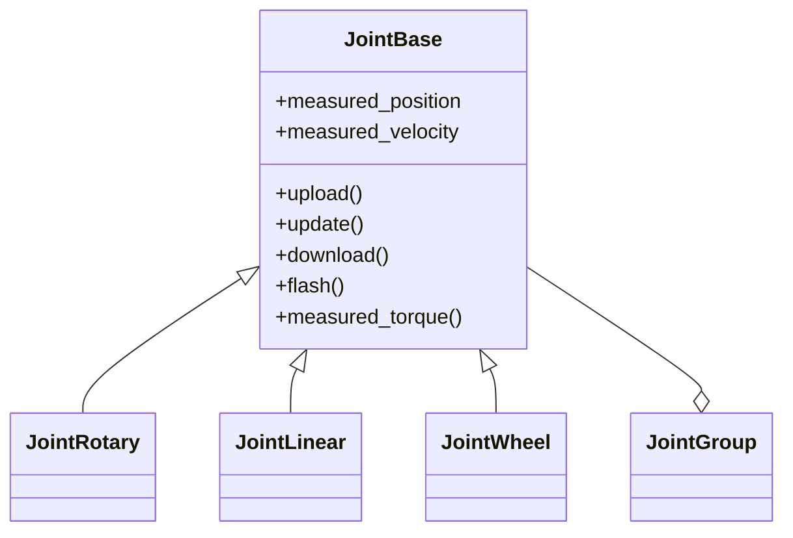
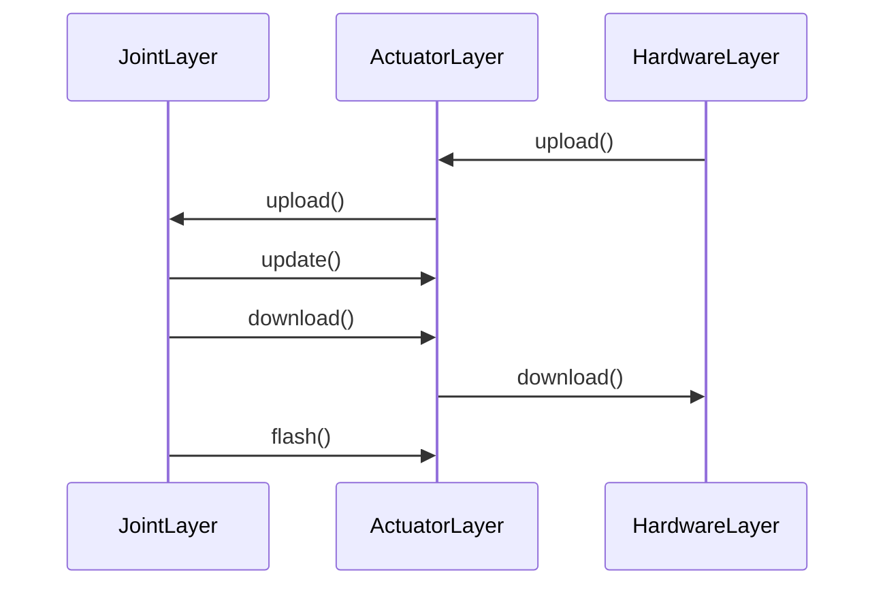

# 关节 （组件层）

关节属于架构设计中的组件层，其下层连接着硬件层，上层连接着机器人层。

关节层的主要功能是将不同关节，使用相同的抽象类型 `joint_base` 进行封装，以便于机器人层调用，统一调用接口。

## 类型关系

关节层的类型关系如下：

> **说明**：
> 这里的图形需要使用支持 `mermaid` 的 Markdown 编辑器才能正常显示。

## 接口说明

关节层的接口说明如下：

- `upload()`：上传关节的状态参数，该方法会从硬件层读取电机的**状态参数**，并将其上传到关节层。数据传输会经过**关节层**，**执行器层**，**硬件层**。
- `update()`：更新关节的状态参数，该方法会从执行器层读取电机的**状态参数**，并将其更新到关节层。数据传输会经过**关节层**，**执行器层**。
- `download()`：下载关节的控制参数，该方法会将关节的**控制参数**下载到硬件层，以便硬件层控制电机。数据传输会经过**关节层**，**执行器层**，**硬件层**。
- `flash()`： 更新关节的控制参数，该方法会将关节的**控制参数**写入到执行器层，以便执行器层在下次 `download()` 时将其下载到硬件层。数据传输会经过**关节层**，**执行器层**。

