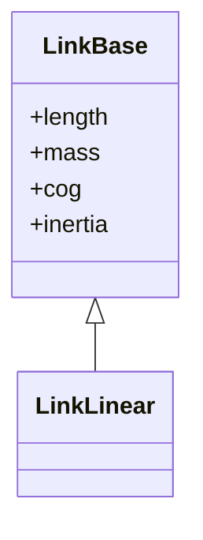

# 连杆 （组件层）

连杆属于架构设计中的组件层，其下层连接着硬件层，上层连接着机器人层。

连杆层的主要功能是将不同连杆，使用相同的抽象类型 `link_base` 进行封装，以便于机器人层调用，统一调用接口。

## 类型关系

连杆层的类型关系如下：

```mermaid
classDiagram
    class LinkBase {
        +length
        +mass
        +cog
        +inertia
    }
    class LinkLinear {
    }
    LinkBase <|-- LinkLinear
```

> **说明**：
> 这里的图形需要使用支持 `mermaid` 的 Markdown 编辑器才能正常显示。
