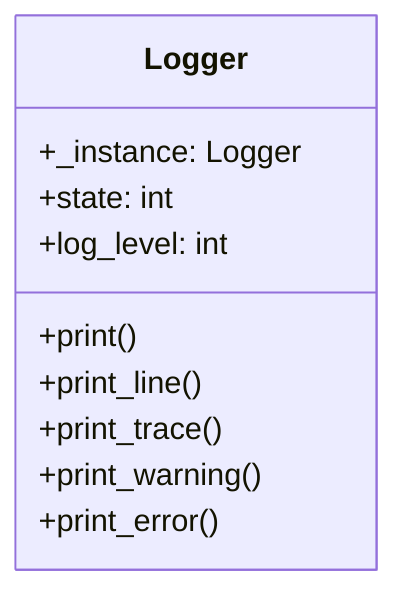

# 日志 （全局）

日志属于架构设计中的全局变量。

## 类型关系

日志层的类型关系如下：

```mermaid
classDiagram
    class Logger {
        +_instance: Logger
        +state: int
        +log_level: int
        +print()
        +print_line()
        +print_trace()
        +print_warning()
        +print_error()
    }
```

> **说明**：
> 这里的图形需要使用支持 `mermaid` 的 Markdown 编辑器才能正常显示。

日志层的 `Logger` 是一个单例类，用于管理整个程序的日志。
