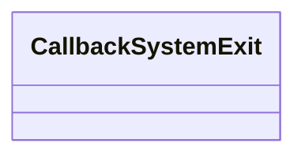

# 回调 （全局）

回调属于架构设计中的全局可用的回调函数，用于处理程序的退出、错误等情况。回调层的设计是为了解决程序退出时的资源释放问题，以及程序运行时的错误处理问题。

## 类型关系

回调层的类型关系如下：

```mermaid
classDiagram
    class CallbackSystemExit {
    }
```

> **说明**：
> 这里的图形需要使用支持 `mermaid` 的 Markdown 编辑器才能正常显示。
