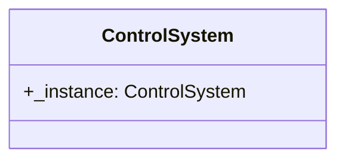

# 控制器 （控制器层）

控制器属于架构设计中的控制器层，其下层连接着机器人层，上层连接着应用层。

控制器层的主要功能是将机器人层的接口进行合理有序地调用，暴露合适的开发接口给外部，提供统一的接口供应用层调用。

## 类型关系

控制器层的类型关系如下：

> **说明**：
> 这里的图形需要使用支持 `mermaid` 的 Markdown 编辑器才能正常显示。

控制器层的 `ControlSystem` 是一个单例类，用于管理整个控制器层的调用。