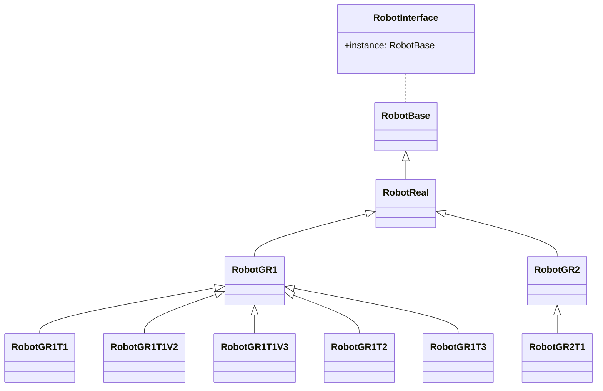

# 机器人 （机器人层）

机器人属于架构设计中的机器人层，其下层连接着控制系统层，上层连接着组件层。

机器人层的主要功能是将不同的机器人组件（如关节、执行器等）组合成一个完整的机器人系统，并提供统一的接口供控制系统层调用。

需要说明的是，`fourier-core` 项目中的机器人层并不包含具体的机器人模型，而是提供了一些通用的机器人基类。
这些基类可以用于更其他的具体机器人项目进行扩展，从而实现不同机器人的控制。

## 类型关系

机器人层的类型关系如下：

> **说明**：
> 这里的图形需要使用支持 `mermaid` 的 Markdown 编辑器才能正常显示。
