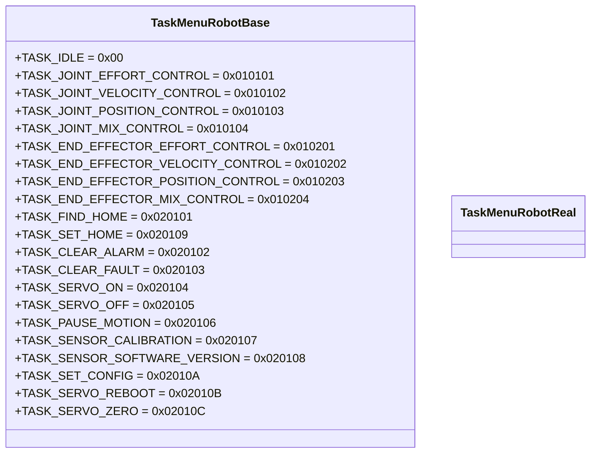

# 任务 （任务层）

任务属于架构设计中的机器人层，其下层连接着控制系统层，上层连接着组件层。

任务层的主要功能是将不同的机器人的算法进行封装，使得控制系统层可以更加方便地调用。

## 类型关系

任务层的类型关系如下：

```mermaid
classDiagram
    class TaskMenuRobotBase {
        +TASK_IDLE = 0x00
        +TASK_JOINT_EFFORT_CONTROL = 0x010101
        +TASK_JOINT_VELOCITY_CONTROL = 0x010102
        +TASK_JOINT_POSITION_CONTROL = 0x010103
        +TASK_JOINT_MIX_CONTROL = 0x010104
        +TASK_END_EFFECTOR_EFFORT_CONTROL = 0x010201
        +TASK_END_EFFECTOR_VELOCITY_CONTROL = 0x010202
        +TASK_END_EFFECTOR_POSITION_CONTROL = 0x010203
        +TASK_END_EFFECTOR_MIX_CONTROL = 0x010204
        +TASK_FIND_HOME = 0x020101
        +TASK_SET_HOME = 0x020109
        +TASK_CLEAR_ALARM = 0x020102
        +TASK_CLEAR_FAULT = 0x020103
        +TASK_SERVO_ON = 0x020104
        +TASK_SERVO_OFF = 0x020105
        +TASK_PAUSE_MOTION = 0x020106
        +TASK_SENSOR_CALIBRATION = 0x020107
        +TASK_SENSOR_SOFTWARE_VERSION = 0x020108
        +TASK_SET_CONFIG = 0x02010A
        +TASK_SERVO_REBOOT = 0x02010B
        +TASK_SERVO_ZERO = 0x02010C
    }
    class TaskMenuRobotReal {
    }
```

> **说明**：
> 这里的图形需要使用支持 `mermaid` 的 Markdown 编辑器才能正常显示。
